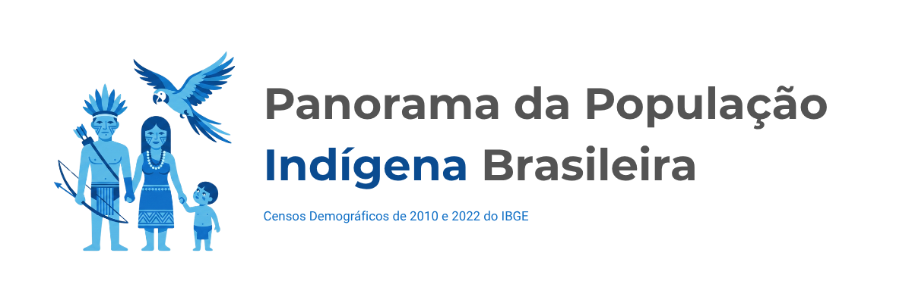

<!-- Cabeçalho -->



<h2 align="center">
<em>Uma investigação baseada em dados sobre a evolução espacial e demográfica da população indígena ao longo de 12 anos.</em>
</h2>

## Sobre o Projeto

Este repositório reúne um conjunto de estudos sobre a população indígena brasileira a partir dos dados dos Censos Demográficos de **2010** e **2022**, publicados pelo **Instituto Brasileiro de Geografia e Estatística (IBGE)**.

O projeto investiga a evolução da população indígena sob diferentes perspectivas, utilizando técnicas de **Análise Exploratória de Dados (EDA)**, **análise geoespacial**, **Data Storytelling** e **visualização de dados** para transformar informações estatísticas em narrativas analíticas acessíveis.

Além das análises desenvolvidas em Python, o projeto dispõe de duas implementações interativas complementares: uma aplicação exploratória desenvolvida em **Streamlit** e um relatório analítico desenvolvido em **Power BI**.

---

## Motivação

A escolha deste tema decorre da relevância social e demográfica da população indígena brasileira, bem como da disponibilidade dos dados publicados pelo Censo Demográfico de 2022.

A divulgação dessa nova base pelo IBGE oferece a oportunidade de investigar as transformações ocorridas ao longo de doze anos, permitindo analisar mudanças na distribuição espacial, na urbanização e na ocupação de Terras Indígenas.

Além de sua importância para a formulação de políticas públicas, o conjunto de dados apresenta características adequadas para a aplicação de técnicas de análise exploratória, análise geoespacial, visualização de dados e data storytelling.

---

# Objetivos

O projeto busca responder questões como:

- O crescimento da população indígena entre 2010 e 2022 foi realmente significativo?
- Esse crescimento ocorreu igualmente em áreas urbanas e rurais?
- Onde a população indígena está concentrada: dentro ou fora das Terras Indígenas?
- Como essa distribuição varia entre estados e regiões brasileiras?
- Quais regiões apresentaram as maiores transformações entre os dois Censos?
- Quais padrões espaciais podem ser observados a partir dos dados do Censo?
- Como os diferentes recortes territoriais alteram a interpretação da distribuição da população indígena?

---

# Dashboards Interativos

O projeto possui duas implementações complementares para exploração e comunicação dos resultados.

## Power BI

Relatório analítico desenvolvido em **Power BI**, voltado à síntese e à comunicação dos principais indicadores do projeto.

O relatório permite explorar:

- indicadores demográficos;
- comparação entre os Censos de 2010 e 2022;
- distribuição espacial por Unidade da Federação;
- concentração da população indígena por Grande Região;
- população urbana e rural;
- população em Terras Indígenas e fora de Terras Indígenas;
- filtros interativos por período, território e situação do domicílio.

### [Explorar o Dashboard no Power BI](https://app.powerbi.com/view?r=eyJrIjoiZjA4MmQ0MDgtMGYyNC00ZTFmLThhN2MtYzgzMWI1NWM5YjJmIiwidCI6Ijk5ZjUxNTc1LWQ2ODEtNDMyYS1iZDNmLTZhNjhjMDVmMGJhNiJ9&embedImagePlaceholder=true)

---

## Streamlit

Aplicação exploratória desenvolvida em **Python, Streamlit e Plotly**, destinada à navegação interativa pelos indicadores e pela distribuição geográfica da população indígena brasileira.

A aplicação complementa o relatório em Power BI ao oferecer uma implementação integralmente desenvolvida no ecossistema Python.

### [Explorar o Dashboard em Streamlit](https://exploracao-dados-indigenas-2010-2022-fxmr2czh5tampra9yggxak.streamlit.app/)

---

# Estudos do Projeto

O projeto foi estruturado como uma sequência de estudos progressivos.

### Estudo 1 — Evolução Demográfica da População Indígena Brasileira

Investigação das transformações demográficas ocorridas entre os Censos de 2010 e 2022.

Principais dimensões:

- crescimento populacional;
- população urbana e rural;
- população em Terras Indígenas;
- população fora de Terras Indígenas.

### Estudo 2 — Distribuição Espacial da População Indígena

Investigação da distribuição territorial da população indígena brasileira.

Principais dimensões:

- concentração por Unidade da Federação;
- distribuição espacial;
- transformações entre 2010 e 2022;
- mapas temáticos.

### Estudo 3 — Perfil Regional

Comparação entre as cinco Grandes Regiões brasileiras:

- Norte;
- Nordeste;
- Centro-Oeste;
- Sudeste;
- Sul.

São analisadas diferenças de crescimento, urbanização, distribuição territorial e presença em Terras Indígenas.

### Estudo 4 — Perfil Estadual

Aprofundamento da análise no nível das Unidades da Federação, utilizando comparações, rankings e visualizações destinadas à identificação de padrões estaduais.

### Estudo 5 — Dashboard Interativo

Consolidação dos principais indicadores dos estudos anteriores em duas aplicações complementares:

- **Streamlit**, para exploração interativa em Python;
- **Power BI**, para análise visual e Business Intelligence.

---

# Estrutura do Projeto

```text
exploracao-dados-indigenas-2010-2022/
│
├── assets/
│   └── banner/
│
├── dashboards/
│   └── powerbi/
│       └── panorama_indigena_2010_2022.pbix
│
├── data/
│   ├── external/
│   ├── geo/
│   ├── processed/
│   │   ├── dashboard/
│   │   ├── geo/
│   │   └── table/
│   └── raw/
│
├── docs/
│   └── 05_dashboard/
│
├── notebooks/
│   ├── 01-01_preprocessing_data_base.ipynb
│   ├── 01-02_demographic_analysis.ipynb
│   ├── 02-01_preprocessing_geo_ibge.ipynb
│   ├── 02-02_spatial_analysis.ipynb
│   └── ...
│
├── outputs/
│   ├── figures/
│       ├── charts/
│       └── maps/   
│
├── src/
│   ├── dashboard/
│   ├── geospatial/
│   ├── preprocessing/
│   └── visualization/
│
├── tests/
│
├── streamlit_app.py
├── pyproject.toml
├── uv.lock
└── README.md
```

---

# Tecnologias

## Análise e Processamento de Dados

- Python
- Pandas
- NumPy
- GeoPandas

## Análise e Visualização Geoespacial

- GeoPandas
- Shapely
- Matplotlib
- Seaborn
- Plotly
- GeoJSON
- TopoJSON

## Dashboards e Business Intelligence

- Streamlit
- Power BI
- Power Query
- DAX

## Desenvolvimento e Qualidade

- Jupyter Notebook
- pytest
- Git
- GitHub
- uv

---

# Fonte dos Dados

## Instituto Brasileiro de Geografia e Estatística — IBGE

**Pessoas indígenas por localização e situação do domicílio, segundo as Grandes Regiões e Unidades da Federação — Brasil — 2010/2022**

https://www.ibge.gov.br/estatisticas/sociais/populacao/22827-censo-demografico-2022.html

**Malhas Territoriais**

https://www.ibge.gov.br/geociencias/organizacao-do-territorio/malhas-territoriais/15774-malhas.html

---

# Próximos Estudos

Com a conclusão do dashboard interativo, o projeto avança para novas etapas analíticas.

### Estudo 6 — Análise Estatística

Exploração estatística dos indicadores demográficos, incluindo:

- distribuições;
- correlações;
- identificação de valores atípicos;
- análise de dispersão;
- possíveis agrupamentos e padrões entre Unidades da Federação.

### Estudos futuros — Integração com outras bases públicas

Estão previstas extensões do projeto por meio da integração com outros indicadores e fontes de dados:

- **Estudo 7 — População indígena × PIB estadual**
- **Estudo 8 — População indígena × IDH**
- **Estudo 9 — População indígena × Desmatamento**
- **Estudo 10 — População indígena × Terras Indígenas**

Essas etapas poderão utilizar dados provenientes do **IBGE, FUNAI, INPE, MapBiomas** e outras instituições públicas.

---

# Autor

**Lucas Dias Noronha**

LinkedIn:

https://www.linkedin.com/in/lucasdiasnoronha/

GitHub:

https://github.com/LUCASDNORONHA/exploracao-dados-indigenas-2010-2022
