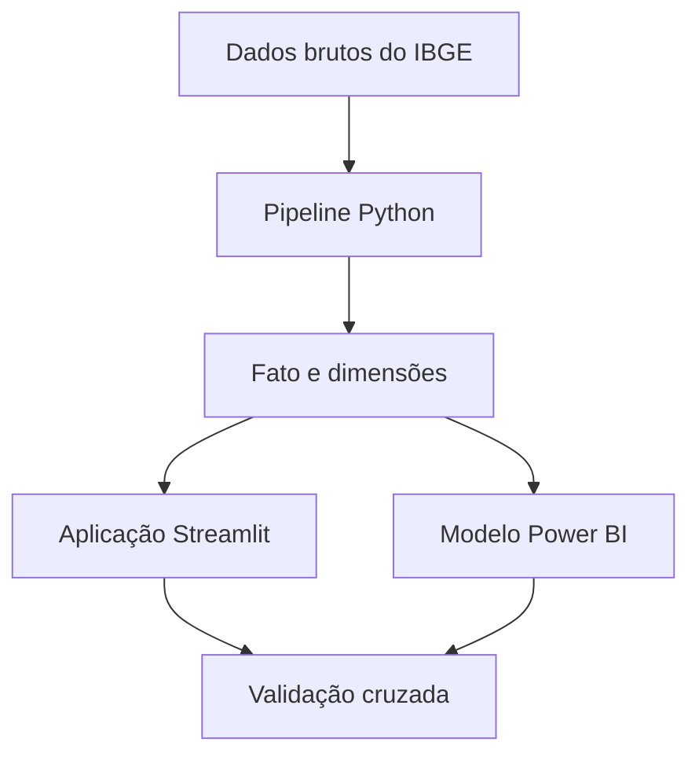

# Especificação funcional — Estudo 5: dashboards interativos

**Versão:** 1.2  
**Data:** 9 de agosto de 2026  
**Estado:** aplicação multipágina iniciada; visão geral implementada

## 1. Finalidade

O Estudo 5 transforma os resultados consolidados nos Estudos 1 a 4 em
dois produtos analíticos complementares:

1. uma aplicação exploratória multipágina em Streamlit;
2. um relatório executivo em Power BI.

Os dois produtos deverão utilizar a mesma camada de dados, responder às
mesmas definições métricas e reproduzir os resultados validados em pandas.
Eles não deverão, contudo, ser cópias visuais um do outro.

## 2. Público e objetivos

### 2.1 Público prioritário

- leitores interessados no panorama demográfico indígena;
- profissionais e estudantes de dados;
- recrutadores e avaliadores de portfólio;
- usuários que desejem explorar regiões e Unidades da Federação.

### 2.2 Objetivos analíticos

- sintetizar o que mudou entre os Censos de 2010 e 2022;
- mostrar onde a população indígena está concentrada;
- comparar perfis regionais;
- permitir o detalhamento das Unidades da Federação;
- distinguir população urbana e rural, dentro e fora de Terras
  Indígenas;
- tornar as definições, fontes e limitações acessíveis ao leitor.

### 2.3 Objetivos de portfólio

- demonstrar desenvolvimento de aplicações analíticas em Python;
- demonstrar tratamento e visualização de dados geoespaciais;
- demonstrar modelagem dimensional e medidas em DAX;
- demonstrar Power Query, filtros, drill-through e tooltips;
- demonstrar testes, documentação e reprodutibilidade.

## 3. Decisões de escopo

| Decisão | Definição |
|---|---|
| Aplicação principal | Streamlit multipágina |
| Relatório complementar | Power BI executivo |
| Gráficos interativos | Plotly |
| Preparação tabular | pandas |
| Preparação geográfica | GeoPandas |
| Fonte canônica | tabelas atômicas geradas pelo pipeline Python |
| Persistência | Parquet para Python e CSV para Power BI |
| Atualização | manual e reproduzível; os Censos não constituem fluxo contínuo |
| Banco de dados | não necessário nesta etapa |
| Publicação | Streamlit Community Cloud e, se disponível, Power BI Service |

## 4. Princípio arquitetural

Os notebooks não participarão da execução do dashboard. Eles permanecem
como documentos de investigação, validação e narrativa. A aplicação deverá
consumir somente artefatos processados pelo pipeline.



## 5. Camada analítica compartilhada

### 5.1 Granularidade da tabela fato

Cada registro representará uma combinação atômica de:

- Unidade da Federação;
- ano censitário;
- localização territorial: TI ou fora de TI;
- situação do domicílio: urbana ou rural;
- população indígena observada.

Não serão armazenadas linhas de total na tabela fato. Totais nacionais,
regionais, estaduais, territoriais e domiciliares serão calculados por
agregação. Essa decisão evita dupla contagem e favorece um modelo estrela.

A cardinalidade esperada é:

`27 UFs × 2 anos × 2 localizações × 2 situações = 216 registros`.

### 5.2 Tabelas previstas

```text
data/processed/dashboard/
├── fact_population.parquet
├── fact_population.csv
├── dim_geography.parquet
├── dim_geography.csv
├── dim_year.csv
├── dim_location.csv
├── dim_domicile.csv
├── states_web.geojson
└── regions_web.geojson
```

### 5.3 Dimensão geográfica

A dimensão geográfica deverá conter, no mínimo:

- código IBGE da UF;
- sigla;
- nome da UF;
- código da Grande Região;
- nome da Grande Região;
- ordem de apresentação.

Brasil e Grandes Regiões serão obtidos por agregação das UFs. As tabelas
oficiais `df_pais.csv` e `df_regioes.csv` permanecerão como referências
independentes para validar os totais agregados.

### 5.4 Indicadores compartilhados

- população indígena;
- crescimento absoluto;
- crescimento relativo;
- participação no Brasil;
- participação na região;
- proporção urbana e rural;
- proporção em TI e fora de TI;
- proporção urbana dentro de TI;
- proporção urbana fora de TI;
- mudança da urbanização em pontos percentuais.

As fórmulas deverão ser documentadas uma única vez. A implementação em
pandas e as medidas em DAX serão testadas contra os mesmos valores de
referência.

## 6. Aplicação Streamlit

### 6.1 Página 1 — Visão geral

**Pergunta:** o que mudou na população indígena brasileira entre 2010 e
2022?

**Conteúdo mínimo:**

- população total em 2022;
- crescimento absoluto e relativo;
- participação urbana;
- participação em TI;
- comparação 2010–2022;
- composição urbano-rural;
- composição TI–fora de TI.

**Interações:** localização territorial e situação do domicílio.

### 6.2 Página 2 — Distribuição espacial

**Pergunta:** onde está a população indígena e como sua distribuição se
alterou?

**Conteúdo mínimo:**

- mapa coroplético estadual;
- seletor de indicador;
- seletor de ano ou variação;
- ranking estadual associado ao mapa;
- tooltip com valor, posição e contexto regional.

O mapa nunca deverá ser a única forma de acesso aos valores. Ranking e
rótulos deverão oferecer leitura alternativa.

### 6.3 Página 3 — Perfil regional

**Pergunta:** como as cinco Grandes Regiões diferem entre si?

**Conteúdo mínimo:**

- participação no total nacional;
- crescimento absoluto e relativo;
- composição urbano-rural;
- presença em TI;
- comparação direta entre regiões;
- destaque das principais diferenças.

### 6.4 Página 4 — Perfil estadual

**Pergunta:** como cada UF se posiciona em relação à sua região e ao
Brasil?

**Conteúdo mínimo:**

- seletor de UF;
- perfil demográfico da UF;
- posição em rankings selecionados;
- comparação com a região e o Brasil;
- presença em TI;
- mudança de urbanização;
- indicação de resultados excepcionais ou contraintuitivos.

### 6.5 Página 5 — Metodologia e dados

- fonte dos dados;
- definição dos indicadores;
- diferenças metodológicas entre os Censos;
- limitações de interpretação;
- arquivos disponíveis para download;
- versão da aplicação e data de atualização.

## 7. Relatório Power BI

### 7.1 Página 1 — Panorama executivo

- KPIs nacionais;
- comparação 2010–2022;
- composição urbano-rural;
- composição TI–fora de TI;
- síntese textual dos principais achados.

### 7.2 Página 2 — Regiões e distribuição espacial

- mapa estadual;
- participação regional;
- crescimento regional;
- ranking;
- segmentadores sincronizados.

### 7.3 Página 3 — Detalhamento estadual

- seleção e drill-through por UF;
- comparação UF–região–Brasil;
- indicadores territoriais;
- ranking e variação de urbanização;
- tooltip personalizado.

### 7.4 Competências obrigatoriamente demonstradas

- tratamento de tipos e metadados no Power Query;
- esquema estrela com relacionamentos de um para muitos;
- medidas explícitas em DAX;
- hierarquia Região → UF;
- contexto de filtro;
- títulos dinâmicos;
- drill-through;
- tooltips de página;
- tema JSON alinhado à identidade visual do projeto.

## 8. Identidade visual

A identidade existente será preservada:

| Função | Cor |
|---|---|
| Azul muito claro | `#DCEAF2` |
| Azul claro | `#8FB7CF` |
| Azul intermediário | `#39708E` |
| Azul escuro | `#173F5F` |
| Texto principal | `#263238` |
| Texto secundário | `#607D8B` |
| Estrutura e grades | `#D9E1E5` |
| Variação negativa | `#B5483A` |

Os títulos deverão comunicar achados ou perguntas analíticas. Cor não será
o único recurso para distinguir séries, estados ou resultados.

## 9. Requisitos de qualidade

### 9.1 Dados

- exatamente 27 UFs na dimensão geográfica;
- exatamente 216 combinações atômicas na tabela fato;
- nenhuma população negativa;
- ausência de duplicações na chave composta;
- agregados idênticos às tabelas oficiais de validação;
- definições idênticas entre pandas e DAX.

### 9.2 Interface

- filtros com efeito analítico explícito;
- estados vazios tratados de maneira compreensível;
- títulos e unidades visíveis;
- tooltips concisos;
- leitura possível sem depender exclusivamente de cor;
- funcionamento em telas estreitas;
- ausência de componentes meramente decorativos.

### 9.3 Reprodutibilidade

- geração das tabelas por comando documentado;
- execução da aplicação em ambiente limpo;
- ausência de caminhos absolutos locais;
- dependências declaradas;
- testes dos cálculos centrais;
- validação cruzada entre pandas, Streamlit e Power BI.

## 10. Fora do escopo inicial

- autenticação de usuários;
- edição ou gravação de dados pelo público;
- banco de dados transacional;
- atualização em tempo real;
- versões completas e redundantes em Dash, Panel ou outra estrutura;
- integração com PIB, IDH ou desmatamento antes dos estudos
  correspondentes.

## 11. Sequência de implementação

1. Aprovar esta especificação e os wireframes.
2. Criar o contrato de dados da tabela fato e das dimensões.
3. Implementar e testar o pipeline da camada de dashboard.
4. Simplificar e validar as geometrias para a web.
5. Criar a estrutura multipágina do Streamlit.
6. Construir as páginas uma a uma.
7. Criar o modelo estrela no Power BI.
8. Construir e validar as medidas em DAX.
9. Montar as páginas executivas do Power BI.
10. Realizar a validação cruzada dos dois produtos.
11. Publicar e executar o teste integral de reprodutibilidade.

## 12. Decisões ainda pendentes

- forma final de publicação do Power BI;
- comportamento exato da seleção de uma UF pelo mapa;
- disponibilidade de uma versão otimizada para dispositivos móveis no
  Power BI;
- conjunto final de arquivos oferecidos para download.

## 13. Estado da implementação

### Concluído

- especificação funcional e primeiro wireframe aprovados;
- contrato formal criado em `docs/05_dashboard/data_contract.md`;
- módulo criado em `src/preprocessing/dashboard_data.py`;
- tabela fato atômica com 216 registros gerada;
- quatro dimensões geradas;
- 270 comparações estaduais aprovadas;
- 48 comparações nacionais e regionais aprovadas;
- módulo criado em `src/preprocessing/dashboard_geospatial.py`;
- GeoJSONs estaduais e regionais simplificados como coberturas e validados;
- redução de 98,689% das coordenadas estaduais, com erro máximo de área de
  0,200602% por UF;
- dependências Streamlit e Plotly declaradas;
- estrutura multipágina criada com `st.Page` e `st.navigation`;
- carregador centralizado, validações de entrada, cache e tema visual criados;
- página de visão geral implementada com dois filtros, quatro KPIs e três
  visualizações interativas;
- quinze testes automatizados aprovados: cinco tabulares, cinco geoespaciais
  e cinco da aplicação.

### Próximo incremento

- implementar a página de distribuição espacial;
- integrar o mapa estadual a `states_web.geojson`;
- construir o ranking sincronizado e validar os indicadores do mapa.
