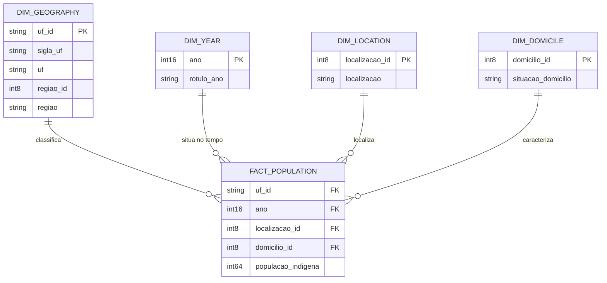

# Contrato de dados — Estudo 5

**Versão:** 1.0  
**Data:** 9 de agosto de 2026  
**Estado:** implementado e sujeito a versionamento

## 1. Finalidade

Este contrato define a camada tabular compartilhada pela aplicação
Streamlit e pelo relatório Power BI. Ele estabelece granularidade, chaves,
tipos, domínios, relações, regras métricas e critérios de validação.

Qualquer alteração incompatível deverá atualizar este documento e a versão
da camada de dados.

## 2. Modelo relacional



## 3. Granularidade da tabela fato

Uma linha da `fact_population` representa:

> uma UF, em um ano censitário, para uma localização territorial e uma
> situação do domicílio.

As categorias são mutuamente exclusivas:

- localização: em TI ou fora de TI;
- domicílio: urbano ou rural.

Não existem linhas de total na tabela fato. Todo total é produzido por
agregação, o que impede dupla contagem.

### 3.1 Cardinalidade esperada

```text
27 UFs × 2 anos × 2 localizações × 2 domicílios = 216 linhas
```

### 3.2 Chave composta

```text
uf_id + ano + localizacao_id + domicilio_id
```

A combinação deverá ser única e não poderá conter valores nulos.

## 4. Dicionário das tabelas

### 4.1 `fact_population`

| Coluna | Tipo Parquet | Tipo Power BI | Regra |
|---|---|---|---|
| `uf_id` | string | texto | código IBGE da UF com dois caracteres |
| `ano` | int16 | número inteiro | somente 2010 ou 2022 |
| `localizacao_id` | int8 | número inteiro | chave de `dim_location` |
| `domicilio_id` | int8 | número inteiro | chave de `dim_domicile` |
| `populacao_indigena` | int64 | número inteiro | valor maior ou igual a zero |

### 4.2 `dim_geography`

| Coluna | Tipo Parquet | Regra |
|---|---|---|
| `uf_id` | string | chave primária; código IBGE da UF |
| `sigla_uf` | string | sigla oficial com dois caracteres |
| `uf` | string | nome oficial da Unidade da Federação |
| `regiao_id` | int8 | código da Grande Região |
| `regiao` | string | nome canônico da Grande Região |
| `ordem_uf` | int16 | ordenação alfabética das UFs |
| `ordem_regiao` | int8 | ordenação oficial de 1 a 5 |

Domínio de `regiao`:

1. Norte;
2. Nordeste;
3. Sudeste;
4. Sul;
5. Centro-Oeste.

### 4.3 `dim_year`

| Coluna | Tipo | Regra |
|---|---|---|
| `ano` | int16 | chave primária: 2010 ou 2022 |
| `rotulo_ano` | string | `Censo 2010` ou `Censo 2022` |
| `ordem_ano` | int8 | 1 para 2010; 2 para 2022 |

### 4.4 `dim_location`

| ID | Localização | Rótulo curto |
|---:|---|---|
| 1 | Em Terras Indígenas | TI |
| 2 | Fora de Terras Indígenas | Fora TI |

### 4.5 `dim_domicile`

| ID | Situação do domicílio |
|---:|---|
| 1 | Urbana |
| 2 | Rural |

## 5. Mapeamento das colunas de origem

| Ano | Localização | Domicílio | Coluna de origem |
|---:|---|---|---|
| 2010 | TI | Urbana | `Indígenas 2010 TI Urbano` |
| 2010 | TI | Rural | `Indígenas 2010 TI Rural` |
| 2010 | Fora TI | Urbana | `Indígenas 2010 Fora TI Urbano` |
| 2010 | Fora TI | Rural | `Indígenas 2010 Fora TI Rural` |
| 2022 | TI | Urbana | `Indígenas 2022 TI Urbano` |
| 2022 | TI | Rural | `Indígenas 2022 TI Rural` |
| 2022 | Fora TI | Urbana | `Indígenas 2022 Fora TI Urbano` |
| 2022 | Fora TI | Rural | `Indígenas 2022 Fora TI Rural` |

## 6. Relações no Power BI

Todas as relações deverão ser de um para muitos, com direção de filtro
única da dimensão para a tabela fato:

| Dimensão | Chave | Fato | Cardinalidade |
|---|---|---|---|
| `dim_geography` | `uf_id` | `fact_population[uf_id]` | 1:* |
| `dim_year` | `ano` | `fact_population[ano]` | 1:* |
| `dim_location` | `localizacao_id` | `fact_population[localizacao_id]` | 1:* |
| `dim_domicile` | `domicilio_id` | `fact_population[domicilio_id]` | 1:* |

Não deverá existir relação direta entre dimensões.

## 7. Definições métricas

Considere `P(a, l, d, g)` como a soma de `populacao_indigena` para o ano
`a`, localização `l`, domicílio `d` e geografia `g`, respeitando o
contexto de filtro.

### 7.1 População indígena

```text
População = soma de populacao_indigena no contexto atual
```

### 7.2 Crescimento absoluto

```text
Crescimento absoluto = População 2022 - População 2010
```

### 7.3 Crescimento relativo

```text
Crescimento relativo =
    (População 2022 - População 2010) / População 2010
```

Se a população de 2010 for zero, o resultado deverá ser nulo, e não
infinito.

### 7.4 Proporção urbana

```text
Proporção urbana = Urbana / (Urbana + Rural)
```

### 7.5 Proporção em TI

```text
Proporção em TI = TI / (TI + Fora TI)
```

### 7.6 Participação no Brasil

```text
Participação no Brasil = População da geografia / População do Brasil
```

Os filtros demográficos devem ser preservados; somente o filtro
geográfico será removido do denominador.

### 7.7 Participação na região

```text
Participação na região = População da UF / População de sua região
```

Os filtros de ano, localização e domicílio deverão ser preservados.

### 7.8 Mudança da urbanização

```text
Mudança da urbanização = Proporção urbana 2022 - Proporção urbana 2010
```

O resultado será expresso em pontos percentuais.

## 8. Arquivos produzidos

```text
data/processed/dashboard/
├── fact_population.parquet
├── fact_population.csv
├── dim_geography.parquet
├── dim_geography.csv
├── dim_year.csv
├── dim_location.csv
└── dim_domicile.csv
```

Os arquivos GeoJSON otimizados serão acrescentados em uma etapa
subsequente do Estudo 5.

## 9. Validações obrigatórias

### 9.1 Estruturais

- 216 linhas na tabela fato;
- 27 chaves geográficas;
- cinco regiões;
- nenhuma duplicação da chave composta;
- nenhum valor nulo;
- nenhuma população negativa;
- oito combinações atômicas por UF.

### 9.2 Aditividade estadual

Para cada UF e ano, deverão coincidir:

- soma das quatro combinações = população total;
- soma de TI urbana e TI rural = total em TI;
- soma de fora de TI urbana e rural = total fora de TI;
- soma urbana dentro e fora de TI = população urbana;
- soma rural dentro e fora de TI = população rural.

Isso produz 270 comparações estaduais:

```text
27 UFs × 2 anos × 5 totais = 270
```

### 9.3 Referências agregadas

As oito combinações atômicas deverão coincidir com:

- oito valores da tabela nacional;
- quarenta valores das cinco tabelas regionais.

Total esperado: 48 comparações agregadas.

## 10. Comando de reprodução

A camada tabular deverá ser reconstruída a partir da raiz do projeto por:

```bash
uv run python -m preprocessing.dashboard_data
```

O comando deverá funcionar independentemente do diretório utilizado pelos
notebooks.
